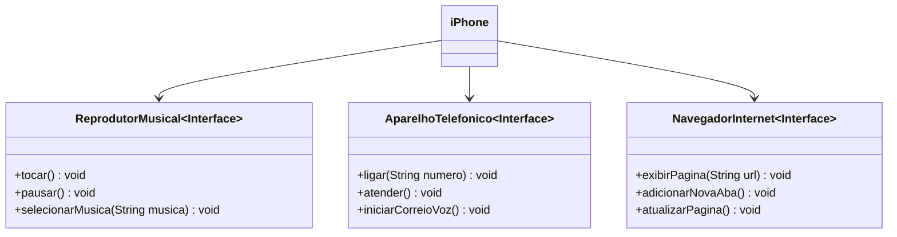

# [DIO](www.dio.me) - Trilha Java Básico

## Autores
- [Luiz Eduardo](https://github.com/LLuizEduardo)

## POO - Desafio

### Modelagem e Diagramação de um Componente iPhone

Neste desafio, foi necessárioi modelar e diagramar a representação UML do componente iPhone, abrangendo suas funcionalidades como Reprodutor Musical, Aparelho Telefônico e Navegador na Internet.

#### Contexto
Com base no vídeo de lançamento do iPhone de 2007 (link abaixo), foi elaborada a diagramação das classes e interfaces utilizando uma ferramenta UML e em seguida, a implementação das classes e interfaces no formato de arquivos `.java`.

[Lançamento iPhone 2007](https://www.youtube.com/watch?v=9ou608QQRq8)
- Minutos relevantes: 00:15 até 00:55

#### Funcionalidades a Modelar
1. **Reprodutor Musical**
   - Métodos: `tocar()`, `pausar()`, `selecionarMusica(String musica)`
2. **Aparelho Telefônico**
   - Métodos: `ligar(String numero)`, `atender()`, `iniciarCorreioVoz()`
3. **Navegador na Internet**
   - Métodos: `exibirPagina(String url)`, `adicionarNovaAba()`, `atualizarPagina()`

### Diagrama UML Iphone (Mermaid)

